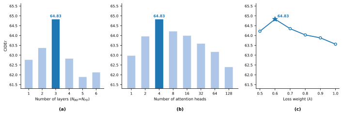
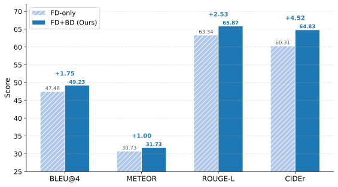
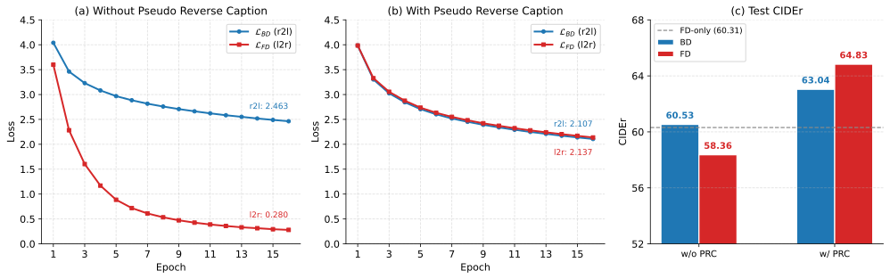
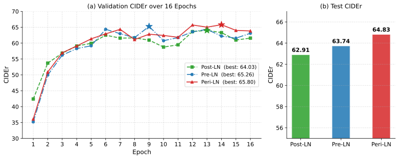

# 5. Experiments

## 5.1. Datasets

We evaluate BiDecT on three widely used video captioning benchmarks. Key statistics are summarized in Table [$\sout{???}$]().

| Dataset | #Captions/Video | #Train | #Validation | #Test |
|---|---|---|---|---|
| MSVD    | ~40 | 1,200  | 100   | 670   |
| MSR-VTT | 20  | 6,513  | 497   | 2,990 |
| VATEX*  | 10  | 25,985 | 3,000 | 5,808 |

Table [$\sout{???}$](). Statistics of the three benchmark datasets used in our experiments. *For VATEX, we use only English captions and report results on the public test set. The VATEX split reflects the videos that are accessible in our experimental setup.
  

**MSVD** [Collecting Highly Parallel Data for Paraphrase Evaluation]() consists of 1,970 short video clips averaging 10 seconds each, with approximately 40 human-annotated captions per clip. We follow the standard split used in prior work.

**MSR-VTT** [MSR-VTT: A Large Video Description Dataset for Bridging Video and Language]() is a generic benchmark of 10,000 clips spanning 20 diverse categories, with 20 captions per clip and an average duration of approximately 15 seconds. We adopt the conventional split used in prior work.

**VATEX** [VATEX: A Large-Scale, High-Quality Multilingual Dataset for Video-and-Language Research]() is a large multilingual dataset of 41,269 video clips, each approximately 10 seconds long and annotated with 10 English and 10 Chinese captions. We use only the English captions and evaluate on the public test set. Because some of the original videos are no longer accessible, our actual split comprises 25,985 training, 3,000 validation, and 5,808 test videos, compared to the official splits of 25,991 / 3,000 / 6,000.

<!-- Nói lý do vì sao ta phải sử dụng cả 3 dataset -->
Together, these three benchmarks span a range of scales (from approximately 2,000 to 41,000 videos) and annotation densities (from 10 to 40 captions per video), allowing us to assess model performance across different data regimes. Their widespread adoption in recent work also enables direct comparison with a broad set of prior methods.

## 5.2. Evaluation Metrics
<!-- Phải ghi công thức ra -->

We report results using four standard metrics for video captioning: BLEU@4 (B4) [Bleu: a method for automatic evaluation of machine translation](), METEOR (M) [Meteor: An automatic metric for mt evaluation with improved correlation with human judgments](), ROUGE-L (R) [Automatic evaluation of machine translation quality using longest common subsequence and skip-bigram statistics](), and CIDEr (C) [Cider: Consensus-based image description evaluation]().

**BLEU@4** evaluates modified n-gram precision between a candidate caption and its references:

$$\text{BLEU@N} = \text{BP} \cdot \exp\left(\sum_{n=1}^{N} w_n \,\text{log}\, p_n\right),$$

where $p_n$ is the clipped n-gram precision, $w_n = 1/N$ are uniform weights, and $\text{BP} = \min\big(1, \exp(1 - r/c)\big)$ is a brevity penalty that discourages overly short outputs ($r$: reference length, $c$: candidate length). We set $N = 4$.

**METEOR** computes a recall-weighted harmonic mean of unigram precision $P$ and recall $R$, scaled by a fragmentation penalty:

$$\text{METEOR} = F_\alpha \cdot (1 - \gamma \cdot f^\beta),$$

where $F_\alpha = \frac{P \cdot R}{\alpha P + (1-\alpha) R}$ and $f$ is the ratio of contiguous matching chunks to total matched unigrams. Matching extends beyond exact tokens to include stems and synonyms.

**ROUGE-L** measures sentence-level overlap based on the longest common subsequence (LCS):

$$F_{lcs} = \frac{(1 + \beta^2) \cdot R_{lcs} \cdot P_{lcs}}{R_{lcs} + \beta^2 \cdot P_{lcs}},$$

where $R_{lcs} = \text{|LCS|}/m$ and $P_{lcs} = \text{|LCS|}/n$, with $m$ and $n$ denoting the lengths of the reference and candidate sentences, respectively.

**CIDEr** is specifically designed for captioning tasks. It represents each sentence as a TF-IDF weighted n-gram vector $\mathbf{g}^n(\cdot)$ and computes the average cosine similarity between the candidate and all references:

$$\text{CIDEr}_n(c_i, S_i) = \frac{1}{M} \sum_{j=1}^{M} \frac{\mathbf{g}^n(c_i) \cdot \mathbf{g}^n(s_{ij})}{\|\mathbf{g}^n(c_i)\| \, \|\mathbf{g}^n(s_{ij})\|},$$

$$\text{CIDEr}(c_i, S_i) = \sum_{n=1}^{N} w_n \cdot \text{CIDEr}_n(c_i, S_i),$$

where $c_i$ is the candidate caption, $S_i = \{s_{i1}, \dots, s_{iM}\}$ are the $M$ reference captions, $w_n = 1/N$, and $N = 4$.

Following common practice in video captioning, we use CIDEr as our primary evaluation metric.

## 5.3. Implementation

**Video Preprocessing.** All raw videos are resized to 240 pixels on their shortest edge and re-encoded using the H.264 codec via FFmpeg, with $\text{KeyInt}$ set to 45. For each video, we keep at most $G$ GOPs, uniformly sampled over time if the video contains more than $G$ GOPs. Based on the 75th percentile of the GOP count distribution in each training set, we set $G$ to 8, 10, and 8 for MSVD, MSR-VTT, and VATEX, respectively.

**Feature Extraction.** Following the extraction pipeline in Section [$\sout{???}$ 4.2](), we pre-compute all features offline and store them in HDF5 format for efficient loading during training and evaluation. Table [$\sout{???}$]() summarizes the specific model and output dimension for each modality.

| Feature | Model | Input Source | Dimension |
|---|---|---|---|
| Appearance | BLIP-2 OPT-2.7B [BLIP-2]() | I-frame | $d_A = 1{,}408$ |
| Semantic | all-RoBERTa-large-v1 (SRoBERTa) [Sentence-BERT]() | BLIP-2 caption | $d_S = 1{,}024$ |
| Motion | MViTv2-small [MViTv2]() | 16 sampled frames | $d_M = 768$ |

Table [$\sout{???}$](). Feature extractors used in BiDecT.
  

**Model Configuration.** We set the model dimension $d_{model} = 512$, the feed-forward dimension $d_{ff} = 2048$, and the number of attention heads to 4. Both the backward and forward decoders consist of 3 stacked Transformer layers ($N_{BD} = N_{FD} = 3$). The maximum caption length is set to 20 for all datasets.

**Training and Inference.** The model is trained for 16 epochs with a batch size of 64. We use the Adam optimizer (AMSGrad variant) with an initial learning rate of $1 \times 10^{-4}$, weight decay of $0.5 \times 10^{-5}$, and gradient clipping at 5.0. The learning rate is linearly warmed up during the first 3 epochs and then reduced by a factor of 0.5 when validation loss does not improve for 3 consecutive epochs. We set the loss weighting hyperparameter $\lambda$ to 0.6, with dropout of 0.1 and label smoothing of 0.15. Caption generation uses beam search with a beam size of 4 for both decoders. The checkpoint with the best validation CIDEr score is selected for evaluation.

## 5.4. Results and Analysis

<table>
  <thead>
    <tr>
      <th rowspan="2">Method</th>
      <th rowspan="2">Year</th>
      <th colspan="4">MSVD</th>
      <th colspan="4">MSR-VTT</th>
    </tr>
    <tr>
      <th>B4</th><th>M</th><th>R</th><th>C</th>
      <th>B4</th><th>M</th><th>R</th><th>C</th>
    </tr>
  </thead>
  <tbody>
    <tr>
      <td>SwinBERT <u>SwinBERT: End-to-End Transformers with Sparse Attention for Video Captioning</u></td>
      <td>2022</td>
      <td>58.2</td><td>41.3</td><td>77.5</td><td>120.6</td>
      <td>41.9</td><td>29.9</td><td>62.1</td><td>53.8</td>
    </tr>
    <tr>
      <td>TextKG <u>Text with Knowledge Graph Augmented Transformer for Video Captioning</u></td>
      <td>2023</td>
      <td>60.8</td><td>38.5</td><td>75.1</td><td>105.2</td>
      <td>43.7</td><td>29.6</td><td>62.4</td><td>52.4</td>
    </tr>
    <tr>
      <td>CoCap <u>Accurate and Fast Compressed Video Captioning</u></td>
      <td>2023</td>
      <td>60.1</td><td>41.4</td><td>78.2</td><td>121.5</td>
      <td>44.4</td><td>30.3</td><td>63.4</td><td>57.2</td>
    </tr>
    <tr>
      <td>CARE <u>Concept-Aware Video Captioning: Describing Videos With Effective Prior Information</u></td>
      <td>2023</td>
      <td>56.3</td><td>39.1</td><td>75.6</td><td>106.9</td>
      <td>48.7</td><td><u>31.5</u></td><td>65.2</td><td>59.7</td>
    </tr>
    <tr>
      <td>BTKG <u>Bidirectional transformer with knowledge graph for video captioning</u></td>
      <td>2024</td>
      <td>55.7</td><td>38.3</td><td>74.7</td><td>104.5</td>
      <td>42.8</td><td>30.0</td><td>62.4</td><td>55.4</td>
    </tr>
    <tr>
      <td>IVRC <u>Rethink video retrieval representation for video captioning</u></td>
      <td>2024</td>
      <td>58.8</td><td>40.3</td><td>77.4</td><td>116.0</td>
      <td>43.7</td><td>30.2</td><td>63.0</td><td>57.1</td>
    </tr>
    <tr>
      <td>OmniViD <u>OmniViD: A Generative Framework for Universal Video Understanding</u></td>
      <td>2024</td>
      <td>59.7</td><td>42.2</td><td>78.1</td><td>122.5</td>
      <td>44.3</td><td>29.9</td><td>62.7</td><td>56.6</td>
    </tr>
    <tr>
      <td>IcoCap <u>IcoCap: Improving Video Captioning by Compounding Images</u></td>
      <td>2024</td>
      <td>59.1</td><td>39.5</td><td>76.5</td><td>110.3</td>
      <td>47.0</td><td>31.1</td><td>64.9</td><td>60.2</td>
    </tr>
    <tr>
      <td>KG-VCN <u>Fully exploring object relation interaction and hidden state attention for video captioning</u></td>
      <td>2025</td>
      <td><u>64.9</u></td><td>39.7</td><td>77.2</td><td>107.1</td>
      <td>45.0</td><td>28.7</td><td>62.5</td><td>51.9</td>
    </tr>
    <tr>
      <td>Track4Cap <u>Frame-by-Frame Multi-Object Tracking-Guided Video Captioning</u></td>
      <td>2025</td>
      <td>62.1</td><td><u>42.5</u></td><td><u>79.8</u></td><td><u>127.2</u></td>
      <td>44.6</td><td>30.5</td><td>63.6</td><td>57.7</td>
    </tr>
    <tr>
      <td>DSSM-KG <u>DSSM-KG: Dual-Stream State-Space Modeling with Adaptive Knowledge Injection for Video Captioning</u></td>
      <td>2025</td>
      <td>57.9</td><td>40.0</td><td>77.0</td><td>111.7</td>
      <td>47.6</td><td>31.2</td><td>65.1</td><td>59.3</td>
    </tr>
    <tr>
      <td>UHCL <u>Unified hierarchical contrastive learning for video captioning</u></td>
      <td>2026</td>
      <td>59.3</td><td>40.5</td><td>77.5</td><td>114.6</td>
      <td><strong>49.4</strong></td><td><strong>31.7</strong></td><td><u>65.6</u></td><td>61.7</td>
    </tr>
    <tr>
      <td>CapDistill <u>Dual-hierarchical knowledge distillation for video captioning</u></td>
      <td>2026</td>
      <td>61.6</td><td>42.4</td><td>79.1</td><td>127.0</td>
      <td>45.3</td><td>30.2</td><td>63.8</td><td>57.9</td>
    </tr>
    <tr>
      <td>MK-VC <u>Scene adaptive dynamic multi-modal knowledge for video captioning</u></td>
      <td>2026</td>
      <td>59.3</td><td>40.6</td><td>77.8</td><td>115.1</td>
      <td>48.1</td><td><strong>31.7</strong></td><td>65.5</td><td><u>62.0</u></td>
    </tr>
    <tr>
      <td>QPDC <u>Ask and focus more: Question-prompt uncertainty allocation for dual-controllable video captioning</u></td>
      <td>2026</td>
      <td>59.4</td><td>38.4</td><td>74.8</td><td>105.2</td>
      <td>42.4</td><td>28.9</td><td>61.9</td><td>51.8</td>
    </tr>
    <tr>
      <td>EMKG <u>Towards generalized video captioning: An effective multi-modal knowledge graph perspective</u></td>
      <td>2026</td>
      <td>59.5</td><td>40.4</td><td>78.0</td><td>116.4</td>
      <td>48.5</td><td><u>31.5</u></td><td>65.1</td><td>61.3</td>
    </tr>
    <tr>
      <td><strong>BiDecT (Ours)</strong></td>
      <td></td>
      <td><strong>67.7</strong></td><td><strong>45.8</strong></td><td><strong>82.9</strong></td><td><strong>138.0</strong></td>
      <td><u>49.2</u></td><td><strong>31.7</strong></td><td><strong>65.9</strong></td><td><strong>64.8</strong></td>
    </tr>
  </tbody>
</table>

Table [$\sout{???}$](). Comparison with state-of-the-art video captioning methods on the test split of MSVD and MSR-VTT. The best and second-best results in each column are denoted by **bold** and <u>underline</u>, respectively.
  

<table>
  <thead>
    <tr>
      <th rowspan="2">Method</th>
      <th rowspan="2">Year</th>
      <th colspan="4">VATEX</th>
    </tr>
    <tr>
      <th>B4</th><th>M</th><th>R</th><th>C</th>
    </tr>
  </thead>
  <tbody>
    <tr>
      <td>SwinBERT <u>SwinBERT: End-to-End Transformers with Sparse Attention for Video Captioning</u></td>
      <td>2022</td>
      <td><u>38.7</u></td><td><u>26.2</u></td><td><u>53.2</u></td><td><u>73.0</u></td>
    </tr>
    <tr>
      <td>CoCap <u>Accurate and Fast Compressed Video Captioning</u></td>
      <td>2023</td>
      <td>35.8</td><td>25.3</td><td>52.0</td><td>64.8</td>
    </tr>
    <tr>
      <td>CARE <u>Concept-Aware Video Captioning: Describing Videos With Effective Prior Information</u></td>
      <td>2023</td>
      <td>37.5</td><td>25.1</td><td>52.4</td><td>63.1</td>
    </tr>
    <tr>
      <td>IVRC <u>Rethink video retrieval representation for video captioning</u></td>
      <td>2024</td>
      <td>32.8</td><td>24.0</td><td>50.3</td><td>57.4</td>
    </tr>
    <tr>
      <td>IcoCap <u>IcoCap: Improving Video Captioning by Compounding Images</u></td>
      <td>2024</td>
      <td>37.4</td><td>25.7</td><td>53.1</td><td>67.8</td>
    </tr>
    <tr>
      <td>RLHMN <u>Learning Hierarchical Modular Networks for Video Captioning</u></td>
      <td>2024</td>
      <td>35.3</td><td>23.1</td><td>50.9</td><td>58.8</td>
    </tr>
    <tr>
      <td>KG-VCN <u>Fully exploring object relation interaction and hidden state attention for video captioning</u></td>
      <td>2025</td>
      <td>33.3</td><td>22.9</td><td>49.5</td><td>53.3</td>
    </tr>
    <tr>
      <td>KEDL <u>KEDL: Knowledge enhancement and disentanglement learning for video captioning</u></td>
      <td>2025</td>
      <td>32.7</td><td>23.3</td><td>49.6</td><td>53.0</td>
    </tr>
    <tr>
      <td>CapDistill <u>Dual-hierarchical knowledge distillation for video captioning</u></td>
      <td>2026</td>
      <td>31.6</td><td>23.9</td><td>49.6</td><td>55.3</td>
    </tr>
    <tr>
      <td>QPDC <u>Ask and focus more: Question-prompt uncertainty allocation for dual-controllable video captioning</u></td>
      <td>2026</td>
      <td>36.8</td><td>24.9</td><td>52.0</td><td>61.3</td>
    </tr>
    <tr>
      <td><strong>BiDecT (Ours)</strong></td>
      <td></td>
      <td><strong>41.4</strong></td><td><strong>27.0</strong></td><td><strong>54.9</strong></td><td><strong>78.2</strong></td>
    </tr>
  </tbody>
</table>

Table [$\sout{???}$](). Comparison with state-of-the-art video captioning methods on the public test set of VATEX. The best and second-best results in each column are denoted by **bold** and <u>underline</u>, respectively.
  

Tables [$\sout{???}$]() and [$\sout{???}$]() compare BiDecT with recent state-of-the-art methods on MSVD, MSR-VTT, and VATEX. All comparison results are taken directly from the respective original papers. The compared methods span a range of design strategies, including end-to-end video Transformers, knowledge graph-augmented pipelines, contrastive learning frameworks, and tracking-guided approaches. BiDecT achieves the highest CIDEr score, our primary evaluation metric, on all three benchmarks and ranks first or second on every reported metric.

**On MSVD**, BiDecT achieves the best score on all four metrics. The improvement is most pronounced on CIDEr, where BiDecT (138.0) surpasses the second-best method, Track4Cap [Frame-by-Frame Multi-Object Tracking-Guided Video Captioning]() (127.2), by 10.8 points, with additional margins of +3.3 on METEOR and +3.1 on ROUGE-L over the same method. Track4Cap augments frame-level features with a multi-object tracking module and an object relation encoder, forming a more complex intermediate pipeline. BiDecT also outperforms KG-VCN [Fully exploring object relation interaction and hidden state attention for video captioning](), which holds the second-highest BLEU@4 (64.9), by 2.8 points despite not relying on graph-based object modeling. These results suggest that rich multimodal features projected directly into the decoder can be more effective than features processed through additional intermediate stages.

**On MSR-VTT**, a more diverse benchmark spanning 20 video categories, performance differences among top methods are narrower. BiDecT achieves the highest CIDEr (64.8), the highest ROUGE-L (65.9), and ties for the highest METEOR (31.7) with UHCL [Unified hierarchical contrastive learning for video captioning]() and MK-VC [Scene adaptive dynamic multi-modal knowledge for video captioning](). On BLEU@4, BiDecT (49.2) is within 0.2 points of UHCL (49.4), which employs triamese decoders with hierarchical contrastive learning. Among knowledge graph-based approaches, MK-VC attains the next-highest CIDEr (62.0) through dynamic fusion of commonsense and video-related knowledge, yet BiDecT leads by 2.8 points without relying on external knowledge construction pipelines.

**On VATEX**, the largest benchmark in our evaluation, BiDecT achieves the best score on all four metrics. CIDEr reaches 78.2, surpassing the second-best method, SwinBERT [SwinBERT: End-to-End Transformers with Sparse Attention for Video Captioning]() (73.0), by 5.2 points. An observation worth noting is that SwinBERT, an end-to-end model from 2022, holds the second-best position across all metrics on this dataset, outperforming several more recent methods that incorporate additional processing modules. BiDecT's consistent improvement over SwinBERT (+2.7 BLEU@4, +0.8 METEOR, +1.7 ROUGE-L, +5.2 CIDEr) suggests that the proposed encoder-free multimodal design generalizes effectively to larger-scale datasets.

Across all three benchmarks, several patterns emerge when examining the results through the lens of our design choices. First, BiDecT consistently outperforms BTKG [Bidirectional transformer with knowledge graph for video captioning](), its most architecturally similar counterpart that also adopts bidirectional decoding but incorporates encoder modules and knowledge graph augmentation (e.g., by +33.5 CIDEr on MSVD and +9.4 on MSR-VTT). Second, BiDecT outperforms CoCap [Accurate and Fast Compressed Video Captioning](), which also exploits compressed video structure, on all three datasets, indicating that GOP-based extraction combined with complementary appearance, semantic, and motion features provides a more effective video representation. Third, BiDecT achieves higher CIDEr than every knowledge graph-augmented method in the comparison, suggesting that semantic features derived from a pre-trained vision-language model can serve as an effective alternative to explicit knowledge graph construction pipelines.

<!-- Chèn thời gian vào để nói rằng encoder-free thật sự nhanh hơn 

- Số lượng layer cho 2 decoder cố định là: 3 (N_BD=N_FD=3)
- Dùng ta dùng 1 encoder khác nhau cho mỗi feature type khác nhau của mỗi decoder => 6 encoder khác nhau.
- Số lượng layer của mỗi encoder của mỗi decoder cũng được set giống nhau: 0 là encoder-free của chúng ta (BiDecT), 1->3 là có encoder.
  - Nếu 0 encoder thì ta sử dụng chiến lược bổ sung type embedding và concat token giống trong section 4.3
  - Nếu có encoder thì ta không bổ sung type embedding, sử dụng encoder, các multimodal feature token sau bước encode sẽ được concat (tương tự encoder-free của chúng ta)
- Số head trong attention được giữ cố dịnh là 4 (giống trong thiết lập) cho cả encoder và decoder
- Kết quả được test trên MSR-VTT, sử dụng GPU: NVIDIA Tesla P100

| Số lượng encoder layer | Thời gian huấn (giây) luyện 1 epoch | Thời gian kiểm thử (giây) trên tập validation 1 epoch | Thời gian kiểm thử (giây) trên tập test | CIDEr |
| --- | --- | --- | --- | --- |
| 0 | 219.77 |  94.15 | 448.43 | 64.83 |
| 1 | 267.79 |  99.74 | 476.01 | 62.25 |
| 2 | 323.33 | 102.80 | 506.85 | 63.77 |
| 3 | 383.46 | 107.25 | 551.93 | 62.67 |
-->
**Encoder-Free Efficiency.** To provide empirical support for the complexity analysis in Section [$\sout{???}$ 4.7](), Table [$\sout{???}$]() compares the encoder-free BiDecT ($N_{Enc} = 0$) with variants that add 1 to 3 Transformer encoder layers per modality per decoder, keeping the same decoder configuration ($N_{BD} = N_{FD} = 3$, 4 attention heads). The encoder-free variant uses type embeddings with direct concatenation (Section [$\sout{???}$ 4.3]()), whereas encoder-based variants employ independent encoders for each feature type and each decoder direction, processing each modality separately before concatenation. The encoder-free configuration achieves both the lowest computational cost and the highest CIDEr. Each additional encoder layer adds approximately 50–60 seconds of training time per epoch, with the three-encoder variant requiring 383.46 s/epoch compared to 219.77 s/epoch for the encoder-free baseline, a 74.5% increase. Test inference time follows a consistent trend, rising from 448.43 s to 551.93 s (+23.1%). Despite this added computation, no encoder-based variant surpasses the encoder-free CIDEr of 64.83; the best encoder-based result is 63.77 at $N_{Enc} = 2$. These findings indicate that features from pre-trained models are sufficiently rich for direct decoding, and that intermediate encoder layers introduce computational overhead without improving caption quality. This outcome is consistent with the theoretical analysis in Section [$\sout{???}$ 4.7](), which establishes that the encoder-free design reduces the dominant complexity from quadratic to linear in $G$.

<table>
  <thead>
    <tr>
      <th rowspan="2">Enc. Layers</th>
      <th colspan="3">Time (seconds)</th>
      <th rowspan="2">C</th>
    </tr>
    <tr>
      <th>Train / epoch</th>
      <th>Val / epoch</th>
      <th>Test</th>
    </tr>
  </thead>
  <tbody>
    <tr>
      <td><strong>0†</strong></td>
      <td><strong>219.77</strong></td>
      <td><strong>94.15</strong></td>
      <td><strong>448.43</strong></td>
      <td><strong>64.83</strong></td>
    </tr>
    <tr>
      <td>1</td>
      <td>267.79</td>
      <td>99.74</td>
      <td>476.01</td>
      <td>62.25</td>
    </tr>
    <tr>
      <td>2</td>
      <td>323.33</td>
      <td>102.80</td>
      <td>506.85</td>
      <td>63.77</td>
    </tr>
    <tr>
      <td>3</td>
      <td>383.46</td>
      <td>107.25</td>
      <td>551.93</td>
      <td>62.67</td>
    </tr>
  </tbody>
</table>

Table [$\sout{???}$](). Effect of the number of encoder layers on computational cost and CIDEr on MSR-VTT. Encoder-based variants employ independent Transformer encoder layers for each feature type and each decoder direction. All variants use $N_{BD} = N_{FD} = 3$ decoder layers with 4 attention heads. Train / epoch and Val / epoch denote wall-clock time for one training and one validation epoch, respectively. Test denotes total inference time on the test set. All timings are measured on a single NVIDIA Tesla P100 GPU. † indicates the encoder-free BiDecT configuration.

## 5.5. Hyperparameter Analysis
<!-- Đánh heading 3 thay cho inline heading ở section 5.5 và 5.6 -->

To analyze the sensitivity of key hyperparameters and the contribution of each component, we conduct all experiments in Sections 5.5 and 5.6 on MSR-VTT unless otherwise stated.

 
Figure [$\sout{???}$](). Hyperparameter sensitivity analysis on MSR-VTT, reporting CIDEr on the test set. (a) Number of decoder layers with $N_{BD} = N_{FD}$. (b) Number of attention heads. (c) Loss weight $\lambda$. Highlighted bars and the star marker indicate the selected configuration.
  

### 5.5.1. Effect of Decoder Depth

Panel (a) of Figure [$\sout{???}$]() shows the effect of the number of decoder layers, with $N_{BD} = N_{FD}$ set equally for both decoders. CIDEr increases steadily from 62.77 at $N = 1$ to 64.83 at $N = 3$, then declines for deeper configurations, dropping to 61.90 at $N = 5$. The optimal depth of three layers provides sufficient capacity to model the multimodal-to-text dependencies without the diminishing returns observed at greater depths.

### 5.5.2. Effect of Attention Heads

Panel (b) of Figure [$\sout{???}$]() shows CIDEr as a function of the number of attention heads. Performance peaks at 4 heads (64.83) and decreases monotonically as the head count increases, reaching 62.40 at 128 heads. With $d_{model} = 512$, each head operates on a subspace of dimension $d_{model}/h$; at 4 heads the per-head dimension is 128, providing a favorable balance between the diversity of attention patterns and the representational capacity of each individual head.

### 5.5.3. Effect of Loss Weight ($\lambda$)

Panel (c) of Figure [$\sout{???}$]() shows the effect of the loss weighting hyperparameter defined in Section [$\sout{???}$ 4.6]() as $\mathcal{L} = (1-\lambda)\,\mathcal{L}_{BD} + \lambda\,\mathcal{L}_{FD}$. CIDEr peaks at $\lambda = 0.6$ (64.83) and decreases monotonically toward $\lambda = 1.0$ (63.56), where the backward decoder receives no direct training signal from its own loss term. The optimal value assigns 60\% of the loss weight to the forward decoder while retaining 40\% for the backward decoder, ensuring that the BD receives sufficient supervision to produce meaningful backward context $\overleftarrow{H}$ rather than relying solely on indirect gradients from $\mathcal{L}_{FD}$.

### 5.5.4. Effect of GOP Count
<!-- Cập nhật lại thời gian theo giá trị từ việc chạy so sánh giữa encoder-free vs -based -->

Table [$\sout{???}$]() reports the effect of the maximum number of GOPs sampled per video, with $\text{KeyInt}$ fixed at 45. CIDEr increases from 63.46 at $G = 6$ (P25) to 64.83 at $G = 10$ (P75) as the model gains access to more temporal segments, but decreases to 64.37 at $G = 12$ (P90), suggesting that GOPs beyond the 75th percentile introduce redundant content without additional benefit. Total inference time increases only marginally across all configurations (from 443.56 to 451.19 seconds over the full test set), confirming that the linear dependence on $G$ in the encoder-free architecture (Section [$\sout{???}$ 4.7]()) translates to negligible computational overhead in practice. These results support the selection of the 75th percentile as the default GOP count across all datasets (Section [$\sout{???}$ 5.1]()).

<table>
  <thead>
    <tr>
      <th rowspan="2">Max GOPs</th>
      <th rowspan="2">Time (s)</th>
      <th colspan="4">MSR-VTT</th>
    </tr>
    <tr>
      <th>B4</th><th>M</th><th>R</th><th>C</th>
    </tr>
  </thead>
  <tbody>
    <tr>
      <td>6 (P25)</td>
      <td>443.56</td>
      <td>48.37</td><td>31.18</td><td>65.22</td><td>63.46</td>
    </tr>
    <tr>
      <td>8 (P50)</td>
      <td>445.27</td>
      <td>48.10</td><td>31.25</td><td>64.97</td><td>64.06</td>
    </tr>
    <tr>
      <td><strong>10 (P75)†</strong></td>
      <td><strong>448.43</strong></td>
      <td><strong>49.23</strong></td><td><strong>31.73</strong></td>
      <td><strong>65.87</strong></td><td><strong>64.83</strong></td>
    </tr>
    <tr>
      <td>12 (P90)</td>
      <td>451.19</td>
      <td>48.76</td><td>31.45</td><td>65.50</td><td>64.37</td>
    </tr>
  </tbody>
</table>

Table [$\sout{???}$](). Effect of the maximum number of GOPs per video on MSR-VTT, with $\text{KeyInt}$ fixed at 45. Pxx denotes the xx-th percentile of the GOP count distribution in the MSR-VTT training set. Time (s) denotes total inference time on the test set. All timings are measured on a single NVIDIA Tesla P100 GPU. † indicates the configuration adopted in our experiments.
  

## 5.6. Ablation Study

### 5.6.1. Effect of Bidirectional Decoding

Figure [$\sout{???}$]() compares the full BiDecT configuration (FD+BD) with a variant that removes the backward decoder entirely (FD-only), reducing the model to a standard unidirectional decoder that conditions solely on the multimodal representation $\overrightarrow{E}$. Introducing the backward decoder yields consistent improvements across all four metrics. The gain is most pronounced on CIDEr (+4.52), our primary metric, followed by ROUGE-L (+2.53), BLEU@4 (+1.75), and METEOR (+1.00). Notably, the two metrics most sensitive to overall caption quality, CIDEr and ROUGE-L, show larger gains than BLEU@4 and METEOR, suggesting that the global backward context $\overleftarrow{H}$ is particularly effective at improving caption coherence rather than isolated word choices.

 
Figure [$\sout{???}$](). Effect of bidirectional decoding on the MSR-VTT test set. FD-only denotes the model without the backward decoder, in which the forward decoder has no access to backward context $\overleftarrow{H}$. FD+BD corresponds to the full BiDecT configuration. Delta values above each bar pair indicate the absolute improvement.
  

### 5.6.2. Effect of Pseudo Reverse Caption
<!-- So sánh kết quả CIDEr của riêng BD và FD của 2 nhóm có và không sử dụng PRC -->

As discussed in Section [$\sout{???}$ 4.6](), training a bidirectional decoder without the pseudo reverse caption strategy risks information leakage, where the forward decoder exploits exact future context encoded in the backward context $\overleftarrow{H}$. Figure [$\sout{???}$]() provides direct empirical evidence for this phenomenon. When the backward decoder is supervised with the exact reversal of the corresponding forward caption (panel a), $\mathcal{L}_{FD}$ drops sharply to 0.28 by epoch 16, while $\mathcal{L}_{BD}$ converges only to 2.463. This nearly $9\times$ gap indicates that the forward decoder is not learning to generate captions from the multimodal input but is instead relying on the word-level correspondence between $\overleftarrow{H}$ and the target caption. In contrast, when pseudo reverse captions are applied (panel b), both losses decrease in parallel and converge to comparable values (2.107 and 2.137), confirming that both decoders face equally challenging generation tasks.

Panel (c) shows the test CIDEr of both decoders under each condition. Without pseudo reverse captions, the FD achieves only 58.36, while the BD reaches 60.53. This inverted ranking, where the auxiliary decoder outperforms the primary one, directly reflects the information leakage: the FD learned to copy from $\overleftarrow{H}$ rather than generate from the multimodal input, and this shortcut collapses at inference when the BD must produce reverse captions without ground-truth access. The FD score (58.36) falls below the FD-only baseline (60.31, dashed line) from Section [$\sout{???}$ 5.6.1](), confirming that bidirectional decoding without pseudo reverse captions is actively harmful. A natural alternative would be to use the reversed BD output as the final caption, but the BD (60.53) barely exceeds the FD-only baseline, indicating that exact-reversal supervision also constrains the BD's ability to learn generalizable representations.

With pseudo reverse captions, the expected ranking is restored: the FD (64.83) surpasses the BD (63.04), confirming that the FD now properly leverages backward context for improved generation. The BD itself also improves from 60.53 to 63.04 (+2.51), suggesting that pseudo-pairing acts as implicit data augmentation by exposing the BD to diverse reverse captions for the same video, which encourages more generalizable representations. The full BiDecT configuration (FD: 64.83) outperforms every single-decoder variant by a substantial margin, confirming that the pseudo reverse caption strategy is a necessary condition for the bidirectional framework to realize its intended benefit.

 
Figure [$\sout{???}$](). Effect of the pseudo reverse caption (PRC) strategy on MSR-VTT. (a) and (b) show the training loss curves of the backward decoder ($\mathcal{L}_{BD}$) and forward decoder ($\mathcal{L}_{FD}$) over 16 epochs, without and with pseudo reverse captions, respectively. (c) compares the test CIDEr of both decoders under each condition. The dashed line indicates the FD-only baseline (60.31) from Section [$\sout{???}$ 5.6.1]().
  

### 5.6.3. Effect of Input Modalities

Table [$\sout{???}$]() reports the results of feature ablation experiments. Among single-modality configurations, appearance achieves the highest CIDEr (61.79), followed by semantic (60.32) and motion (51.02). Both appearance and semantic features are derived from the BLIP-2 vision-language model pipeline (Section [$\sout{???}$ 4.2]()), while motion features are extracted from MViTv2, a video classification model. The performance gap suggests that VLM-derived representations, which capture both visual content and its alignment with language, provide a stronger foundation for caption generation than temporal motion features alone. Every two-modality combination outperforms its constituent single-modality results, and the full three-modality configuration achieves the best overall performance, confirming that the three feature types are complementary.

The table also reveals the critical role of the embedding module design described in Section [$\sout{???}$ 4.3](). Without type embeddings, the three-modality model (CIDEr 61.18) performs worse than appearance alone (61.79), indicating that the decoder cannot distinguish tokens from different modalities and that the concatenated features interfere with rather than complement each other. Applying type embeddings restores the expected benefit of multimodal input. Additionally, using independent embedding modules for the backward and forward decoders (CIDEr 64.83) outperforms a single shared module (62.53) by 2.30 points, suggesting that separate modules allow each decoder to learn its own feature projection without the parameter conflict that arises when a single module must serve both decoders simultaneously.

<!-- Thay x bằng dấu "-" hoặc bỏ trống -->
<table>
  <thead>
    <tr>
      <th rowspan="2">App</th>
      <th rowspan="2">Sem</th>
      <th rowspan="2">Mot</th>
      <th rowspan="2">Type Emb</th>
      <th rowspan="2">Ind. Emb.</th>
      <th colspan="4">MSR-VTT</th>
    </tr>
    <tr>
      <th>B4</th><th>M</th><th>R</th><th>C</th>
    </tr>
  </thead>
  <tbody>
    <!-- Single modality -->
    <tr>
      <td>✓</td><td>−</td><td>−</td><td>−</td><td>✓</td>
      <td>46.86</td><td>30.98</td><td>64.55</td><td>61.79</td>
    </tr>
    <tr>
      <td>−</td><td>✓</td><td>−</td><td>−</td><td>✓</td>
      <td>45.39</td><td>30.42</td><td>63.62</td><td>60.32</td>
    </tr>
    <tr>
      <td>−</td><td>−</td><td>✓</td><td>−</td><td>✓</td>
      <td>40.10</td><td>28.24</td><td>59.60</td><td>51.02</td>
    </tr>
    <!-- Two modalities -->
    <tr>
      <td>✓</td><td>✓</td><td>−</td><td>✓</td><td>✓</td>
      <td>48.35</td><td>31.56</td><td>65.07</td><td>63.32</td>
    </tr>
    <tr>
      <td>✓</td><td>−</td><td>✓</td><td>✓</td><td>✓</td>
      <td>47.62</td><td>31.18</td><td>64.74</td><td>62.34</td>
    </tr>
    <tr>
      <td>−</td><td>✓</td><td>✓</td><td>✓</td><td>✓</td>
      <td>47.11</td><td>30.92</td><td>64.27</td><td>61.17</td>
    </tr>
    <!-- All 3 modalities, no type embedding -->
    <tr>
      <td>✓</td><td>✓</td><td>✓</td><td>−</td><td>✓</td>
      <td>47.27</td><td>30.82</td><td>64.50</td><td>61.18</td>
    </tr>
    <!-- Embedding module design -->
    <tr style="border-top: 2px solid #000;">
      <td>✓</td><td>✓</td><td>✓</td><td>✓</td><td>−</td>
      <td>48.74</td><td>31.45</td><td>65.55</td><td>62.53</td>
    </tr>
    <!-- Full model (BiDecT) -->
    <tr>
      <td>✓</td><td>✓</td><td>✓</td><td>✓</td><td>✓</td>
      <td><strong>49.23</strong></td><td><strong>31.73</strong></td>
      <td><strong>65.87</strong></td><td><strong>64.83</strong></td>
    </tr>
  </tbody>
</table>

Table [$\sout{???}$](). Ablation study on input modalities and embedding module design, evaluated on the MSR-VTT test set. App / Sem / Mot denote appearance, semantic, and motion features. Type Emb indicates whether modality-specific type embeddings are applied. Ind. Emb. indicates whether the backward and forward decoders use independent (✓) or shared (−) feature embedding modules. The second-to-last row evaluates a shared embedding module variant with all three modalities enabled. The last row corresponds to the full BiDecT configuration.
  

### 5.6.4. Effect of Layer Normalization Strategy

Figure [$\sout{???}$]() compares the three normalization placements discussed in Section [$\sout{???}$ 3.2.3](). Peri-LN achieves the highest test CIDEr (64.83), outperforming Pre-LN (63.74) and Post-LN (62.91). The validation curves in panel (a) further show that Peri-LN maintains higher scores in the later training epochs, reaching the best validation CIDEr (65.80) at epoch 14. This ranking is consistent with the analysis in Section [$\sout{???}$ 3.2.3](), where Peri-LN is motivated by its ability to control hidden-state magnitudes through dual normalization, mitigating the gradient propagation issues of Post-LN and the variance accumulation risk of Pre-LN.

 
Figure [$\sout{???}$](). Comparison of layer normalization strategies on MSR-VTT. (a) Validation CIDEr over 16 training epochs; stars mark the best epoch for each strategy. (b) Test CIDEr of the checkpoint selected at the best validation epoch.
  

## 5.7. Case Study
<!-- Vẽ lại hình sao cho hình trải rộng theo hàng ngang -->

 
Figure [$\sout{???}$](). Qualitative examples of captions generated by BiDecT on MSVD, MSR-VTT, and VATEX. For each video, representative frames are shown alongside two ground-truth (GT) captions and the model prediction (Pred). In the predictions, **bold green** [#00B050]() text denotes correctly predicted key terms, and **bold red** [#FF0000]() text denotes hallucinated content. <u>Underlined orange</u> [#ED7D31]() text in the ground-truth captions marks important details not captured by the prediction. Examples (a)–(d) are success cases; example (e) is a failure case.
  

To complement the quantitative evaluation, Figure [$\sout{???}$]() presents qualitative examples from all three benchmark datasets. We select four success cases and one failure case to illustrate how the generated captions reflect the proposed design choices and to identify remaining limitations.

The success cases highlight several complementary strengths. In examples (a) and (c), the model demonstrates accurate identification of objects, attributes, and actions: for the MSVD cooking scene, BiDecT generates "a girl slowly adds milk to a bowl of eggs", capturing both the scene objects and the manner of the action; for the MSR-VTT makeup tutorial, it produces "a woman is applying red lipstick", correctly specifying the color and the product. This descriptive specificity is consistent with the multimodal ablation in Section [$\sout{???}$ 5.6.3](), where combining appearance and VLM-derived semantic features yields the strongest caption quality: appearance features identify visual entities, while semantic features provide activity-level context that supports precise descriptions such as "slowly" and "red lipstick". In example (b), the prediction "three boys are performing a dance" correctly identifies the number of agents and their activity, though it omits the audience context present in the reference. Example (d) demonstrates temporal understanding: BiDecT generates "a man blows up a blue balloon and then twists it to make a shape", capturing a multi-step action sequence in correct chronological order. This temporal awareness is consistent with the GOP-based sampling strategy (Section [$\sout{???}$ 5.5.4]()), which distributes the input across different temporal segments, and with the backward decoder's global preview (Section [$\sout{???}$ 5.6.1]()) that enables the forward decoder to plan a coherent sequential description.

Example (e) illustrates a remaining limitation. The video shows a young woman yawning in her room, but BiDecT generates "a young girl is sitting in a room and singing loudly", correctly identifying the setting but hallucinating the core action. The visual similarity between yawning and singing, both involving a wide-open mouth and audible vocalization, appears to mislead the model, which substitutes the less common action with one that better fits its learned language priors. This confusion is not unique to the model: one of the ten human annotators for this video also described the action as "singing out loud with her mouth wide open", suggesting that the visual ambiguity is genuine rather than solely an artifact of the model's representations. This case indicates that the current multimodal features, while effective for distinguishing objects and capturing temporal patterns, can be insufficient for discriminating between visually similar actions. Incorporating finer-grained temporal features or audio-visual grounding may help address such ambiguities in future work.
