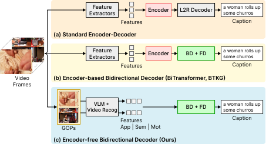

<!-- Vẽ 1 hình minh họa nào đó dùng trong introduction và related work, hình này không cần quá chi tiết mà nên đề cập đến các nhóm phương pháp khác nhau trong video captioning và cần làm nổi bật sự khác biệt của BiDecT
-->

# 1. Introduction

<!-- overview the task -->

Video captioning, the task of generating textual descriptions for video content, has attracted broad research interest due to its practical applications such as video retrieval, human-computer interaction, and assistive technology for visually impaired people. Addressing this task requires a model to understand spatial appearance, temporal dynamics, and their alignment with natural language, making it a challenging problem at the intersection of computer vision and natural language processing. The field has evolved from template-based approaches [Describing Video Contents in Natural Language | YouTube2Text: Recognizing and Describing Arbitrary Activities Using Semantic Hierarchies and Zero-shot Recognition]() and CNN-RNN encoder-decoder frameworks [Describing Videos by Exploiting Temporal Structure | Sequence to Sequence – Video to Text]() to Transformer-based architectures [End-to-End Dense Video Captioning with Masked Transformer | TVT: Two-View Transformer Network for Video Captioning](), which now constitute the dominant paradigm.

<!-- limitation of prior work -->

Within the Transformer-based paradigm, recent video captioning methods often follow two common architectural tendencies that deserve closer examination. The first is to introduce substantial intermediate processing before caption generation. Visual features are commonly refined through stacked encoder layers or intermediate fusion stages before reaching the decoder, while semantic understanding is often further augmented through external knowledge graphs constructed from object detection results. Although these components have contributed to measured improvements, they also increase architectural complexity and introduce risks of noise propagation from imperfect intermediate outputs. The second tendency concerns the decoding process itself: caption generation is typically formulated as a strictly left-to-right (L2R) autoregressive process, which prevents the model from accessing future linguistic context.

These tendencies become increasingly worth revisiting in light of modern large-scale pre-trained models. The visual and semantic representations produced by such models are already rich and well-structured; additional encoding stages or external knowledge construction pipelines may therefore introduce unnecessary overhead without proportional gain. On the decoding side, bidirectional approaches, where a reverse-direction context supplements standard L2R generation, have been shown to improve caption coherence [BiTransformer | Bidirectional transformer with knowledge graph for video captioning](), but existing implementations still incorporate intermediate encoder modules to process extracted features before decoding. The combination of encoder-free feature integration and bidirectional autoregressive decoding thus remains underexplored in video captioning. Figure [???]() illustrates these architectural paradigms, highlighting the position of the proposed approach relative to existing designs.

 
Figure [$\sout{???}$](). Comparison of three architectural paradigms in Transformer-based video captioning. (a) Standard encoder-decoder: extracted features are processed through an intermediate encoder before a left-to-right decoder. (b) Encoder-based bidirectional decoder (e.g., BiTransformer, BTKG): extracted features are processed through intermediate encoder module(s) before being passed to a backward decoder (BD) and a forward decoder (FD). (c) Encoder-free bidirectional decoder (BiDecT, proposed): multimodal features are projected directly into the bidirectional decoder system without any intermediate encoding stage.

<!-- address challenge & contribution -->

Motivated by these observations, we propose Encoder-free Bidirectional Decoder Transformer (BiDecT), a video captioning model that removes the intermediate encoder and integrates multimodal features directly into a bidirectional decoding framework. To reduce redundant frame-level processing, we represent each video as a sequence of Groups of Pictures (GOPs) and extract three complementary feature types from each: appearance features extracted from a pre-trained vision-language model, semantic representations derived from the descriptions it generates, and motion features that capture temporal dynamics within the segment. A lightweight embedding module then projects these features into a shared representation space before they are fed directly to the decoder system. The decoding system consists of a backward decoder that generates a reverse caption to construct a global right-to-left context, and a forward decoder that conditions on both the projected multimodal features and this reverse context to produce the final caption. During training, we adopt a pseudo reverse caption strategy to mitigate information leakage between the backward and forward decoding processes.

The main contributions of this work are as follows:

- We propose BiDecT, an encoder-free video captioning framework that integrates multimodal features directly into a bidirectional decoder system without any intermediate encoding stage. To the best of our knowledge, this is the first approach to combine encoder-free feature projection with bidirectional autoregressive decoding for video captioning.
- We design a GOP-based multimodal feature extraction pipeline that derives appearance, semantic, and motion representations from structured video segments. By confining feature extraction to frames within the same GOP, the pipeline exploits intra-segment temporal coherence to reduce redundant information across video frames.
- We introduce a dual-purpose feature extraction scheme that leverages both the image encoder and the caption generator of a pre-trained vision-language model: the image encoder provides the appearance representation, while the generated frame-level caption is encoded into a dense sentence embedding that serves as the semantic representation. This design transfers rich visual and linguistic knowledge from image captioning to video captioning, providing semantic grounding without explicit knowledge graph construction.
- Experiments on three widely adopted video captioning datasets (MSVD, MSR-VTT, and VATEX) demonstrate that BiDecT achieves competitive performance against state-of-the-art methods, while ablation studies validate the contribution of each design component.

<!-- Bổ sung paper outline -->

The remainder of this paper is organized as follows. Section 2 reviews related work. Section 3 provides background on the GOP structure and Transformer building blocks used in our model. Section 4 describes the proposed BiDecT architecture in detail. Section 5 presents experimental results, comparisons with state-of-the-art methods, hyperparameter analysis, and ablation studies. Section 6 concludes the paper.

# 2. Related Work
<!--
- Các paper trong RW phải có tính liên kết -> phải làm rõ, phân tích ưu / nhược điểm của các phương pháp? Họ giải quyết khó khăn như thế nào? 
- Nội dung này có thể là đánh giá chủ quan từ chúng ta dựa trên paper của họ chứ không nhất thiết phải chính xác hoàn toàn, tất nhiên là phải phù hợp với paper của họ
-->

## 2.1. Multimodal Feature Extraction and Intermediate Processing

In Transformer-based video captioning, feature extraction is typically structured around two broad paradigms. In the offline feature extraction paradigm, multiple features are pre-computed from video frames and used as model input during training and inference, without exposing the model to raw video data [Concept-Aware Video Captioning: Describing Videos With Effective Prior Information | Bidirectional transformer with knowledge graph for video captioning](). Another line of research adopts end-to-end video Transformers, such as SwinBERT [SwinBERT: End-to-End Transformers with Sparse Attention for Video Captioning](), where the model takes raw video frames as direct input and relies on an integrated backbone to learn visual features jointly with caption generation.

Raw extracted features are rarely passed to the decoder without modification. A recurring motivation for further processing is that features from extractors are typically holistic and frame-level, lacking the explicit object-level and relational structure that fine-grained captioning requires. Methods in this line therefore differ mainly in which missing structure they attempt to recover. IVRC [Rethink video retrieval representation for video captioning]() inserts a learnable token-shift module and a Refineformer to strengthen temporal modeling through multi-grained cross-modal alignment. Track4Cap [Frame-by-Frame Multi-Object Tracking-Guided Video Captioning]() instead targets object identity over time, augmenting frame-level features with a multi-object tracking module and an object-relation encoder. KG-VCN [Fully exploring object relation interaction and hidden state attention for video captioning]() focuses on spatial structure, applying graph convolutional networks to model inter-object dependencies, while HSRA [Action-Driven Semantic Representation and Aggregation for Video Captioning]() organizes visual semantic content into an object–action–event hierarchy to make actions explicit. These modules can yield measurable gains in their targeted settings, yet they share a common trade-off: each one deepens the processing pipeline and makes final caption quality dependent on an additional intermediate predictor (a detector, tracker, or graph builder) whose errors may propagate downstream, while also adding structural and computational cost.

This trade-off becomes more pronounced as pre-trained extractors continue to improve. Given that modern models such as CLIP [Learning Transferable Visual Models From Natural Language Supervision]() and MViTv2 [MViTv2: Improved Multiscale Vision Transformers for Classification and Detection]() already produce rich and well-structured representations, it is worth asking whether additional intermediate processing stages still provide proportional improvements, or whether they risk degrading the quality of representations that are already informative. This question motivates a design that projects extracted multimodal features directly into the decoder via a lightweight embedding layer, without complex intermediate processing modules.

## 2.2. Semantic Knowledge Augmentation for Video Captioning

A parallel challenge is that visual features alone provide limited high-level semantic information and offer weak coverage of rare or long-tailed words. To compensate, a substantial body of work injects external semantic knowledge into the captioning model, and the dominant direction has been knowledge graph-based augmentation. The evolution of this line reflects repeated attempts to address the same weakness: that injected knowledge is often static or only loosely relevant to the specific video. Early approaches retrieve relatively static knowledge: TextKG [Text with Knowledge Graph Augmented Transformer for Video Captioning]() retrieves commonsense facts from ConceptNet and feeds them into a two-stream network, while BTKG [Bidirectional transformer with knowledge graph for video captioning]() moves toward relational structure by using TransE to predict inter-object relationships and integrating them into the encoder. More recent methods advance toward scene-adaptive knowledge: MK-VC [Scene adaptive dynamic multi-modal knowledge for video captioning]() combines static commonsense with dynamic video-related knowledge, EMKG [Towards generalized video captioning: An effective multi-modal knowledge graph perspective]() builds a ConceptVision Knowledge Graph that couples visual object features with commonsense relationships, and DSSM-KG [DSSM-KG: Dual-Stream State-Space Modeling with Adaptive Knowledge Injection for Video Captioning]() pairs a Mamba-Transformer hybrid with adaptive knowledge injection.

This progression toward increasingly adaptive knowledge is itself instructive: it indicates that the core difficulty is not access to knowledge but control over its relevance. Regardless of how adaptive the mechanism becomes, incorporating explicit semantic knowledge inherently requires additional stages for concept extraction, knowledge retrieval or construction, and knowledge fusion, which increases structural complexity and leaves the pipeline susceptible to noise propagation. The trend is acknowledged within the line itself: several recent methods explicitly introduce adaptive fusion mechanisms whose primary purpose is to suppress irrelevant knowledge [Scene adaptive dynamic multi-modal knowledge for video captioning | Towards generalized video captioning: An effective multi-modal knowledge graph perspective]().

An emerging alternative circumvents this trade-off by drawing semantic representations directly from pre-trained vision-language models (VLMs) rather than from constructed knowledge graphs. A recent study [Pretrained Image-Text Models are Secretly Video Captioners]() shows that an image captioning model built on BLIP-2 [BLIP-2: Bootstrapping Language-Image Pre-training with Frozen Image Encoders and Large Language Models](), when post-trained on only a small set of video-text pairs, can rival specialized video captioning systems without any video-specific architectural modifications. Similarly, IcoCap [IcoCap: Improving Video Captioning by Compounding Images]() shows that compounding concise image samples into video training further improves caption quality. Together, these findings suggest that the semantic understanding embedded in VLMs transfers effectively to the video domain, offering a more direct alternative to explicit knowledge graph pipelines.

## 2.3. Decoding Strategies and Bidirectional Context Modeling

Beyond how features are prepared, a parallel line of work targets the decoder itself. The standard Transformer decoder generates text autoregressively from left to right (L2R), a setting in which the model tends to over-rely on language priors and has limited mechanisms to stay grounded in the visual input. Such approaches differ in how they redirect the decoder's attention toward visual content. UHCL [Unified hierarchical contrastive learning for video captioning]() employs triamese decoders with hierarchical contrastive learning to counter generic, low-distinctiveness captions. ASGNet [Adaptive semantic guidance network for video captioning]() introduces an adaptive control decoder that dynamically rebalances visual and textual contributions to mitigate over-reliance on language priors. QPDC [Ask and focus more: Question-prompt uncertainty allocation for dual-controllable video captioning]() uses a question-prompt mechanism to steer the decoder toward salient visual content. These approaches improve specific aspects of generation, but they share a structural rather than incidental limitation: operating strictly left to right, none can condition the current token on future linguistic context.

Bidirectional decoding addresses this limitation directly. BiTransformer [BiTransformer: augmenting semantic context in video captioning via bidirectional decoder]() introduces a backward decoder that generates a right-to-left sequence, providing reverse-direction context to guide the final L2R generation. BTKG [Bidirectional transformer with knowledge graph for video captioning]() extends this idea by assigning separate encoders to the forward and backward decoders to accommodate different modal features. A shared challenge in training such decoders is information leakage: if the backward decoder is supervised with the exact reversal of the corresponding forward caption, the forward decoder can trivially exploit the future words encoded in the backward context. Both BiTransformer and BTKG address this by randomly shuffling reversed captions within each video's caption pool to break exact word-level correspondences and force the model to learn genuine semantic dependencies, a strategy later formally termed pseudo reverse caption by BTKG. Notably, both designs still pre-process extracted features through intermediate encoder modules before decoding, inheriting the same processing-stage trade-off discussed earlier.

The proposed BiDecT adopts the bidirectional decoding framework of BiTransformer and BTKG, including the pseudo reverse caption strategy for preventing information leakage. The key distinction lies in the overall architecture: while BiTransformer and BTKG both incorporate intermediate encoder modules to pre-process extracted features before decoding, BiDecT eliminates the encoder entirely and projects multimodal features directly into the decoder. Additionally, rather than drawing on appearance and motion features alone, BiDecT incorporates a third semantic modality derived from a pre-trained vision-language model, providing richer semantic grounding without the structural overhead of external knowledge graph pipelines. To the best of our knowledge, BiDecT is the first approach to combine encoder-free feature projection with bidirectional autoregressive decoding for video captioning.
