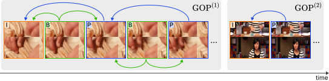
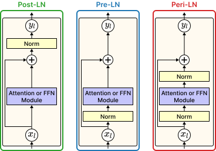

<!-- Hạn chế dùng từ "we/us/our", tức là trình bày theo thể bị động hoặc để tên component/module làm chủ ngữ chính. Từ "we" chỉ nên dùng trong đoạn propose/contribution -->

# 3. Background

## 3.1. Group of Pictures (GOP) Structure

In modern video compression standards, such as H.264 and H.265, reducing temporal redundancy between consecutive frames is a key mechanism for optimizing storage. Based on data dependencies and coding techniques, frames within a compressed video sequence are categorized into three primary types: I-frames (Intra-coded frames), P-frames (Predictive frames), and B-frames (Bi-predictive frames). I-frames, or keyframes, rely exclusively on spatial intra-prediction without referring to any other frames. Along with spatial prediction, P-frames and B-frames incorporate temporal inter-prediction to retain only the changes with respect to reference frames. While P-frames refer only to preceding frames, B-frames can refer to both past and future frames. Consequently, whereas I-frames serve to capture the complete spatial context and static appearance of a scene, both P-frames and B-frames primarily serve to encode its temporal dynamics and motion variations.

These complementary frame types are not arranged arbitrarily; instead, they are organized into a periodic structural pattern called a Group of Pictures (GOP). As illustrated in Figure [$\sout{???}$](), each GOP begins with an I-frame and encompasses all subsequent P-frames and B-frames prior to the next I-frame. Functioning as an independently decodable unit, a specific GOP ensures that its internal frames do not refer to any frames in adjacent GOPs. As a result, this strict boundary naturally partitions a compressed video into self-contained spatio-temporal chunks.

**Discussion.** This inherent structural independence provides a distinct advantage for video understanding tasks. Traditional video captioning frameworks often process densely sampled individual frames. However, this strategy is computationally expensive and introduces massive redundant information, leading to severe computational bottlenecks. By conceptualizing a video as a continuous sequence of GOPs rather than individual frames, our approach treats each GOP as a fundamental input unit. This allows the model to effectively bypass temporal redundancy while preserving the critical spatio-temporal dynamics required to generate accurate captions.

<!-- Dùng actual frame của video để minh họa -->
 
Figure [$\sout{???}$](). The Group of Pictures (GOP) structure in compressed video, illustrated with decoded frames from a sample video. Each GOP begins with an I-frame and encompasses all subsequent P-frames and B-frames prior to the next I-frame. Arrows point from each predicted frame toward its reference frame(s), indicating the dependencies used for temporal inter-prediction.
  

## 3.2. Transformer Building Blocks
<!-- Phải có 1 câu dẫn nhập để nói được lý do vì sao chúng ta cần tóm tắt attn + ffn (ngắn thôi) => để làm nổi bật tại sao chúng ta dùng peri-ln
-->

The standard Transformer architecture consists of an encoder and a decoder, both constructed by stacking identical layers. A single layer typically contains multiple sub-layers, each built around either the attention mechanism or the position-wise feed-forward network (FFN). In addition, every sub-layer is paired with a residual connection and layer normalization. Since the placement of normalization relative to these modules is a key design choice in our model, the following sections briefly review the attention mechanism and FFN before discussing the normalization strategies adopted in this work.

### 3.2.1. Attention Mechanism

At the core of the Transformer is the scaled dot-product attention mechanism, which maps a set of query $(Q)$, key $(K)$, and value $(V)$ representations to an output:

$$
\begin{align}
\text{Attention}(Q, K, V) = \text{Softmax}\left(\frac{Q K^T}{\sqrt{d_k}}\right) V,
\end{align}
$$

where $d_k$ denotes the key dimension. The scaling factor $\sqrt{d_k}$ prevents the dot products from becoming excessively large, which helps avoid softmax saturation and extremely small gradients.

To capture information from different representation subspaces simultaneously, the Transformer further adopts multi-head attention (MHA):

$$
\begin{align}
\text{MultiHead}(Q, K, V) = \text{Concat}(\text{head}_1, \dots, \text{head}_h) W^O,
\end{align}
$$

$$
\begin{align}
\text{where } \text{head}_i = \text{Attention}(Q W_i^Q, K W_i^K, V W_i^V),
\end{align}
$$

where $W_i^Q$, $W_i^K$, and $W_i^V$ are learnable projection matrices for each head $i$, $W^O$ is the learnable output projection matrix, and $h$ is the number of attention heads. This design allows the model to attend to information from multiple representation subspaces in parallel.

Depending on the sources of $Q$, $K$, and $V$, attention can be categorized into self-attention and cross-attention. In self-attention, $Q$, $K$, and $V$ are all derived from the same sequence, allowing the model to capture dependencies within that sequence. In cross-attention, $Q$ is taken from one sequence, while $K$ and $V$ are taken from another, enabling the model to gather relevant context across different representations.

### 3.2.2. Position-Wise Feed-Forward Network (FFN)

In the Transformer, the position-wise feed-forward network (FFN) consists of two linear transformations with a non-linear activation in between. Following common practice in modern Transformer-based models, GELU is adopted in place of the traditional ReLU activation. The FFN is therefore defined as:

$$
\begin{align}
\text{FFN}(X) = \text{GELU}(X W_1 + b_1) W_2 + b_2,
\end{align}
$$

where $W_1$, $W_2$, $b_1$, and $b_2$ are learnable parameters.

### 3.2.3. Layer Normalization Strategies

During the training of deep Transformer models, the placement of layer normalization (LN) plays a critical role in controlling gradient stability and convergence speed. Traditionally, Post-LN and Pre-LN have been the two most widely adopted strategies, despite their limitations in large-scale training.

**Post-LN.** As the original normalization strategy [Attention is all you need](), Post-LN applies normalization after the residual addition:

$$y_l = \text{Norm} \big(x_l + \text{Module}(x_l)\big), $$

where $x_l$ and $y_l$ denote the input and output hidden states of the $l$-th sub-layer, respectively. Here, $\text{Module}$ denotes either attention or FFN in the Transformer sub-layer, and $\text{Norm}$ refers to a normalization operation such as LayerNorm or RMSNorm.

Although Post-LN helps control the magnitude of hidden states, gradient signals must pass through the normalization layer during backpropagation. In deep networks, this can weaken gradient propagation and lead to slower and less stable convergence [On layer normalization in the transformer architecture | Transformers get stable: An end-to-end signal propagation theory for language models]().

**Pre-LN.** To alleviate the gradient propagation issue of Post-LN, Pre-LN applies normalization to the hidden state before it enters the module [On layer normalization in the transformer architecture]():

$$y_l = x_l + \text{Module}\big(\text{Norm}(x_l)\big). $$

While Pre-LN improves gradient flow during early training [On layer normalization in the transformer architecture](), it applies normalization only to the module input. Under this design, if the module produces an output with a large magnitude, the variance of hidden states can accumulate exponentially across sub-layers. This compounding effect can produce massive activations that destabilize the optimization process [Massive activations in large language models]().

**Peri-LN.** More recent architectures have adopted a third strategy, termed Peri-LN [Peri-LN | Gemma4](), which is designed to address the limitations of both Post-LN and Pre-LN. Conceptually, Peri-LN can be viewed as an extension of Pre-LN, where an additional normalization layer is applied to the module output:

$$y_l = x_l + \text{Norm}_{out}\Big(\text{Module}\big(\text{Norm}_{in}(x_l)\big)\Big). $$

By applying normalization to both the input and output of each module, Peri-LN provides tighter control over hidden-state magnitudes. The additional output normalization introduces a damping factor that bounds the gradient norm [Peri-LN](), effectively constraining variance accumulation and mitigating the risk of massive activations, even in deep networks. For clarity, Figure [$\sout{???}$]() compares the structures of the Post-LN, Pre-LN, and Peri-LN strategies.

Motivated by these stability benefits, we adopt Peri-LN with standard residual connections across all sub-layers of the proposed video captioning model. Since this structural pattern is applied uniformly throughout the network, normalization layers and residual connections are left implicit in subsequent formulations and diagrams. This abstraction avoids unnecessary repetition and keeps the following method descriptions concise and focused on the core design choices.

<!-- Cập nhật lại màu cho từng loại LN tương ứng với abls -->
 
Figure [$\sout{???}$](). Comparison of layer normalization placements in a Transformer sub-layer. From left to right: Post-LN, Pre-LN, and Peri-LN.
  

# 4. Method

## 4.1. Overview

Our proposed architecture, termed BiDecT, leverages bidirectional context for video caption generation. The key difference between BiDecT and previous approaches [BiTransformer | Bidirectional transformer with knowledge graph for video captioning]() is its encoder-free design. Specifically, the extracted multimodal features are integrated into the Transformer-based bidirectional decoder framework, without relying on any intermediate encoder. This design is motivated by the observation that features extracted by large pre-trained models already provide strong representations. Removing the intermediate encoder reduces computational overhead and avoids unnecessary transformation of the pre-trained feature representations.

As shown in Figure [$\sout{???}$](), BiDecT treats an input video as a sequence of GOPs (Section [$\sout{???}$ 3.1]()) rather than individual frames to improve computational efficiency. The overall pipeline consists of four main components. First, the **Multimodal Feature Extraction** obtains three complementary feature types (appearance, semantic, and motion) from all GOPs in the video. Next, the **Multimodal Feature Embedding** projects these features into a shared model dimension and unifies them into a single representation for the decoders. Then, the **Backward Decoder (BD)** predicts the caption in reverse order to construct the global backward context $\overleftarrow{H}$. Finally, the **Forward Decoder (FD)** generates the caption from left to right by conditioning on both the multimodal representation and the context $\overleftarrow{H}$. The detailed design of each component is described in the following sections.

<!--
- Đưa "nx" vào trong để làm nổi bật số lượng lần xử lý
- Emb module tạo 1 layer ẩn phía sau, bỏ 2x
-->
 
Figure [$\sout{???}$](). Overview of the proposed BiDecT architecture. Multimodal features (appearance, semantic, and motion) are extracted across all GOPs of the input video and then embedded into a multimodal representation for the decoders. The BD generates the global backward context $\overleftarrow{H}$, which is then used by the FD to produce the final caption.
  

## 4.2. Video Representation and Multimodal Feature Extraction

<!-- **Video Representation.** -->
Following the GOP-based video representation introduced in Section [$\sout{???}$ 3.1](), the input video $X$ is formally defined as a sequence of GOPs:

$$X = \left[ \text{GOP}^{(1)}, \dots, \text{GOP}^{(G)} \right],$$

where $G$ denotes the maximum number of GOPs sampled per video. Each GOP begins with an I-frame and is followed by a sequence of P/B-frames:

$$\text{GOP}^{(g)} = \left[\text{I}^{(g)}, \text{P/B}^{(g, 1)}, \dots, \text{P/B}^{(g, \text{KeyInt}-1)}\right].$$

Here, $\text{KeyInt}$ (Keyframe Interval) denotes the maximum distance between two consecutive I-frames during the video compression process. Therefore, each GOP contains at most $\text{KeyInt}-1$ P/B-frames.

**Feature Extraction Process.** Appearance and motion features are commonly used in multimodal video representation. However, relying only on these two modalities often leaves a semantic gap between low-level visual content and high-level natural language descriptions. To narrow this gap, we introduce a third modality: semantic features. For each $\text{GOP}^{(g)}$, these three types of features are derived as follows.

**Appearance and Semantic Features (from I-frame).** Because the I-frame provides the most complete static view within each GOP, it serves as the single source for extracting both appearance and scene-level semantic information via pre-trained BLIP-2 [BLIP-2: Bootstrapping Language-Image Pre-training with Frozen Image Encoders and Large Language Models]() and SRoBERTa [Sentence-BERT: Sentence Embeddings using Siamese BERT-Networks](). First, the I-frame is fed into the image encoder of BLIP-2, and the resulting $\text{[CLS]}$ token is used as the appearance feature $a^{(g)}$. Next, BLIP-2 generates a textual description for the same I-frame. This description is then encoded by SRoBERTa to produce the semantic feature $s^{(g)}$.

**Motion Features (from GOP sequence).** Although the I-frame provides strong static context, it cannot capture the motion and short-term dynamics within a GOP. To model this dynamic information, pre-trained MViTv2 [MViTv2: Improved Multiscale Vision Transformers for Classification and Detection]() processes a sampled frame sequence from $\text{GOP}^{(g)}$, producing the motion feature $m^{(g)}$.

Applying this process to all $G$ GOPs yields three distinct features: appearance $F_A = [a^{(1)}, \dots, a^{(G)}] \in \mathbb{R}^{G \times d_A}$, semantic $F_S = [s^{(1)}, \dots, s^{(G)}] \in \mathbb{R}^{G \times d_S}$, and motion $F_M = [m^{(1)}, \dots, m^{(G)}] \in \mathbb{R}^{G \times d_M}$. The dimensions $d_A$, $d_S$, and $d_M$ depend on the respective pre-trained models. These features are then passed to the multimodal feature embedding module.

## 4.3. Multimodal Feature Embedding

**Feature Projection.** Learnable modality-specific linear projections first map the extracted features (appearance $F_A$, semantic $F_S$, and motion $F_M$) into a shared $d_{model}$-dimensional space:

$$F'_A = \text{Linear}_A(F_A),$$
$$F'_S = \text{Linear}_S(F_S),$$
$$F'_M = \text{Linear}_M(F_M).$$

These projections yield $F'_A, F'_S, F'_M \in \mathbb{R}^{G \times d_{model}}$.

**Type and Positional Embeddings.** Because the projected features are merged into a single decoder input, each of them is augmented with a distinct learnable type embedding $(\text{TE}_{A/S/M} \in \mathbb{R}^{d_{model}})$ to indicate its source modality, and a shared sinusoidal positional embedding $(\text{PE} \in \mathbb{R}^{G \times d_{model}})$ to preserve the temporal order of GOPs. Separate learnable normalization layers are then applied, yielding the normalized embeddings:

$$E_A = \text{Norm}_A(F'_A + \text{TE}_A + \text{PE}),$$
$$E_S = \text{Norm}_S(F'_S + \text{TE}_S + \text{PE}),$$
$$E_M = \text{Norm}_M(F'_M + \text{TE}_M + \text{PE}).$$

These normalized embeddings are then concatenated to form a unified multimodal representation:

$$E = \text{Concat}(E_A, E_S, E_M) \in \mathbb{R}^{3G \times d_{model}}.$$

This embedding module is instantiated twice with independent parameters, producing $\overleftarrow{E}$ and $\overrightarrow{E}$ for the backward and forward decoders, respectively.

## 4.4. Backward Decoder (BD)

The backward decoder (BD) shares the core design of a standard Transformer decoder, employing Peri-LN (Section [$\sout{???}$ 3.2.3]()) uniformly across all sub-layers. Rather than generating text from left to right, the BD predicts the video caption in reverse order by conditioning on the previously generated words and the multimodal representation $\overleftarrow{E}$.

Given the reverse prefix $\overleftarrow{\hat{Y}_{<t'}} = [\overleftarrow{\hat{y}_{1}}, \dots, \overleftarrow{\hat{y}_{t'-1}}]$ and the corresponding normalized word embeddings $\overleftarrow{Z_{<t'}} = [\overleftarrow{z_{1}}, \dots, \overleftarrow{z_{t'-1}}]$, a single BD layer updates the hidden state at decoding step $t'$ through three core sub-layers: masked self-attention, cross-attention to $\overleftarrow{E}$, and a position-wise feed-forward network. The computation is formulated as:

$$ \overleftarrow{u_{t'}} = \text{Masked-Self-Attention}(\overleftarrow{z_{t'-1}}, \overleftarrow{Z_{<t'}}, \overleftarrow{Z_{<t'}}), $$
$$ \overleftarrow{c_{t'}} = \text{Cross-Attention}(\overleftarrow{u_{t'}}, \overleftarrow{E}, \overleftarrow{E}), $$
$$ \overleftarrow{o_{t'}} = \text{FFN}(\overleftarrow{c_{t'}}), $$

where $\overleftarrow{u_{t'}}$, $\overleftarrow{c_{t'}}$, and $\overleftarrow{o_{t'}}$ denote the output hidden states of the respective sub-layers at step $t'$.

The BD comprises $N_{BD}$ identical layers. The output of the last FFN sub-layer is passed through an additional normalization layer to obtain the final backward hidden state $\overleftarrow{h_{t'}}$:

$$ \overleftarrow{h_{t'}} = \text{Norm}\left(\overleftarrow{o_{t'}^{(N_{BD})}}\right). $$

The probability distribution of the predicted word $\overleftarrow{\hat{y}_{t'}}$ is calculated as:

$$ P(\overleftarrow{\hat{y}_{t'}} \mid \overleftarrow{\hat{Y}_{<t'}}, \overleftarrow{E}) = \text{Softmax}(\text{Linear}(\overleftarrow{h_{t'}})). $$

Decoding continues autoregressively until the model predicts the end-of-sequence marker $\langle \text{S} \rangle$. The complete reverse caption is denoted as $\overleftarrow{\hat{Y}}= [\overleftarrow{\hat{y}_1},\dots,\overleftarrow{\hat{y}_{T'}},\langle \text{S} \rangle]$.

**Global Backward Context.** Beyond predicting the reverse caption, the final backward hidden states capture a right-to-left semantic context across the entire generated caption. Together, they serve as the global backward context $\overleftarrow{H}$:

$$ \overleftarrow{H} = [\overleftarrow{h_1}, \dots, \overleftarrow{h_{T'}}], $$

which is then passed to the forward decoder as an auxiliary conditioning signal (Figure [$\sout{??? overview archi}$]()).

## 4.5. Forward Decoder (FD)

The forward decoder (FD) shares the same core design as the BD but introduces an additional cross-attention sub-layer. The FD generates the final caption in a standard left-to-right manner, conditioned on the previously generated words, the multimodal representation $\overrightarrow{E}$, and the global backward context $\overleftarrow{H}$.

Given the forward prefix $\overrightarrow{\hat{Y}_{<t}} = [\overrightarrow{\hat{y}_{1}}, \dots, \overrightarrow{\hat{y}_{t-1}}]$ and the corresponding normalized word embeddings $\overrightarrow{Z_{<t}} = [\overrightarrow{z_{1}}, \dots, \overrightarrow{z_{t-1}}]$, a single FD layer updates the hidden state at decoding step $t$ through four sub-layers:

$$ \overrightarrow{u_{t}} = \text{Masked-Self-Attention}(\overrightarrow{z_{t-1}}, \overrightarrow{Z_{<t}}, \overrightarrow{Z_{<t}}), $$
$$ \overrightarrow{c_{t}} = \text{Cross-Attention}(\overrightarrow{u_{t}}, \overrightarrow{E}, \overrightarrow{E}), $$
$$ \overrightarrow{c'_{t}} = \text{Cross-Attention}(\overrightarrow{c_{t}}, \overleftarrow{H}, \overleftarrow{H}), $$
$$ \overrightarrow{o_{t}} = \text{FFN}(\overrightarrow{c'_{t}}), $$

where $\overrightarrow{c'_{t}}$ integrates the attended multimodal representation $\overrightarrow{c_{t}}$ with the context $\overleftarrow{H}$ before passing through the FFN sub-layer.

The FD comprises $N_{FD}$ identical layers. The output of the last FFN sub-layer is normalized and used to calculate the probability distribution of the predicted word $\overrightarrow{\hat{y}_{t}}$:

$$ \overrightarrow{h_{t}} = \text{Norm}\left(\overrightarrow{o_{t}^{(N_{FD})}}\right), $$
$$ P(\overrightarrow{\hat{y}_{t}} \mid \overrightarrow{\hat{Y}_{<t}}, \overrightarrow{E}, \overleftarrow{H}) = \text{Softmax}(\text{Linear}(\overrightarrow{h_{t}})). $$

This process repeats autoregressively until the end-of-sequence marker $\langle \text{S} \rangle$ is predicted, resulting in the final caption $\overrightarrow{\hat{Y}} = [\overrightarrow{\hat{y}_1}, \dots, \overrightarrow{\hat{y}_{T}}, \langle \text{S} \rangle]$.

## 4.6. Optimization

The BiDecT model is trained by jointly optimizing both decoders via cross-entropy losses. For a given video $X$ with its backward and forward multimodal embeddings $\overleftarrow{E}$ and $\overrightarrow{E}$, let $\overrightarrow{Y}=[\overrightarrow{y_1},\dots,\overrightarrow{y_L}]$ be its ground-truth forward caption and $\overleftarrow{Y}=[\overleftarrow{y_1},\dots,\overleftarrow{y_{L'}}]$ be its paired pseudo reverse caption. The cross-entropy losses for the backward and forward decoders are defined as:

$$ \mathcal{L}_{BD} = -\sum_{t'=1}^{L'} \log P(\overleftarrow{y_{t'}} \mid \overleftarrow{Y_{<t'}}, \overleftarrow{E};\; \theta_{BD}), $$

$$ \mathcal{L}_{FD} = -\sum_{t=1}^{L} \log P(\overrightarrow{y_{t}} \mid \overrightarrow{Y_{<t}}, \overrightarrow{E}, \overleftarrow{H};\; \theta_{BD}, \theta_{FD}), $$

where $\theta_{BD}$ and $\theta_{FD}$ denote the trainable parameters of the backward and forward decoders, respectively. Notably, $\mathcal{L}_{FD}$ explicitly depends on $\theta_{BD}$ because the FD incorporates the global backward context $\overleftarrow{H}$ produced by the BD. Consequently, gradients from $\mathcal{L}_{FD}$ flow back through the BD, ensuring that $\overleftarrow{H}$ is jointly optimized for both reverse and forward caption generation.

The overall loss is a weighted combination of both objectives:

$$ \mathcal{L} = (1-\lambda)\,\mathcal{L}_{BD} + \lambda\,\mathcal{L}_{FD}, $$

where $\lambda \in [0,1]$ is a hyperparameter that balances the contribution of the two decoders. Label smoothing is also applied during training to mitigate model overconfidence.

**Pseudo Reverse Captions.** A critical challenge in bidirectional decoding is the prevention of information leakage. If the BD were supervised with the exact word-for-word reversal of the corresponding forward caption, the FD could trivially exploit the future context implicitly encoded in $\overleftarrow{H}$, causing the FD to degenerate into a simple copying mechanism.

To address this, we adopt a randomization strategy inspired by prior works in bidirectional decoding [BiTransformer | Bidirectional transformer with knowledge graph for video captioning](). Specifically, this strategy leverages the fact that each video in the dataset typically has multiple reference captions. For a given video, a word-for-word reversal is first applied to all associated forward captions to form a video-specific backward pool. As illustrated in Figure [$\sout{???}$](), these candidates are then randomly shuffled and pseudo-paired with the forward captions, preventing the FD from exploiting trivial word-level mappings between $\overleftarrow{H}$ and the target caption.

<!-- Vẽ lại hình sao cho mũi tên từ Forward nằm ẩn bên dưới -->
 
Figure [$\sout{???}$](). Construction of pseudo reverse captions. Forward captions are reversed word-for-word to form a video-specific backward pool, then randomly shuffled and pseudo-paired with the original forward captions to prevent information leakage.
  

## 4.7. Computational Complexity Analysis

To analyze the computational efficiency of the encoder-free design, this section compares how the time complexity of BiDecT and standard encoder-decoder architectures scales with $G$, the number of GOPs representing a given video. Let $d_{model}$ be the model dimension, and let $L$ and $L'$ denote the sequence lengths of the forward and backward captions, respectively. The feature extraction and embedding pipeline produces a unified multimodal sequence of length $3G$.

Since feature extraction is performed offline prior to training, the analysis is restricted to the trainable components whose complexity depends on $G$. Components such as text embeddings and projection heads are $G$-independent and are therefore omitted. As feature embedding introduces only a linear-in-$G$ cost in both architectures, it does not alter the asymptotic comparison.

**Standard Encoder-Decoder Complexity.** In standard encoder-decoder architectures for video captioning, multimodal tokens are first processed by one or more Transformer encoder layers before decoding. Within each encoder layer, the self-attention mechanism computes pairwise affinities across a token sequence of length proportional to $G$, while the FFN sub-layer processes each token independently, yielding a per-layer complexity of:

$$\mathcal{O}(G^2 \cdot d_{model} + G \cdot d_{model}^2).$$

Because the number of encoder layers is a fixed hyperparameter, this is also the aggregate cost of the entire encoding stage. As $G$ grows, this cost scales quadratically in $G$.

**BiDecT Architecture Complexity.** By contrast, BiDecT eliminates the intermediate encoding stage, relying exclusively on cross-attention within the decoders to query the multimodal sequence. For the backward decoder (BD), the computational cost per layer arises from masked self-attention over the backward caption, cross-attention to the multimodal sequence, and the FFN sub-layer, yielding a per-layer complexity of:

$$\mathcal{O}({L'}^2 \cdot d_{model} + L' \cdot G \cdot d_{model} + L' \cdot d_{model}^2).$$

Similarly, the forward decoder (FD) computes masked self-attention over the forward caption, cross-attention to the multimodal sequence, an additional cross-attention to the global backward context $\overleftarrow{H}$ (of length $L'$), and the FFN sub-layer, yielding a per-layer complexity of:

$$\mathcal{O}(L^2 \cdot d_{model} + L \cdot G \cdot d_{model} + L \cdot L' \cdot d_{model} + L \cdot d_{model}^2).$$

**Overall Complexity Comparison.** Since the number of decoder layers is a fixed hyperparameter, the overall complexity of BiDecT is determined by the sum of the BD and FD per-layer costs. Critically, the proposed design completely removes the encoder cost of $\mathcal{O}(G^2 \cdot d_{model} + G \cdot d_{model}^2)$. Instead, the only $G$-dependent term in BiDecT is the cross-attention to the multimodal sequence, which scales as $\mathcal{O}\big((L+L') \cdot G \cdot d_{model}\big)$, while all remaining terms are bounded and independent of $G$. In summary, BiDecT reduces the dominant computational cost from quadratic to linear in $G$, offering a more scalable architecture for video captioning, particularly as $G$ increases.
