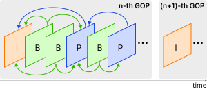

# 3. Background

## 3.1. Group of Pictures (GOP) Structure

In modern video compression standards, such as H.264 and H.265, leveraging temporal redundancy between consecutive frames is a crucial mechanism for optimizing storage. Based on data dependencies and coding techniques, frames within a compressed video sequence are generally categorized into three primary types [$\sout{CITE}$]():

1. **I-frame (Intra-coded frame):** An I-frame, also known as a keyframe, is encoded independently using intra-prediction. It does not rely on any other frames for reconstruction. Consequently, an I-frame explicitly contains complete appearance information, capturing the full spatial context and original objects within a scene.
2. **P-frame (Predictive frame):** A P-frame utilizes uni-directional inter-prediction. To save storage space, it only records the visual differences relative to a preceding reference frame (which can be either an I-frame or a previously decoded P-frame). These differences are efficiently encoded using motion vectors and residual errors.
3. **B-frame (Bi-predictive frame):** A B-frame employs bi-directional inter-prediction. It references information from both past and future frames to find the best matching blocks, maximizing storage efficiency. Similar to P-frames, its content is represented by motion vectors and residuals.

    
    
Figure 1. The Group of Pictures (GOP) structure in compressed video. In each GOP, the first frame is always an I-frame, which is then followed by several P/B-frames until the next I-frame appears.

**Group of Pictures (GOP) Structure.** The I-frames, P-frames, and B-frames are not arranged randomly; rather, they follow a periodic, repeating pattern known as the Group of Pictures (GOP) structure. As illustrated in Figure [$\sout{???}$](), each GOP strictly begins with an I-frame and encompasses all subsequent P-frames and B-frames until the next I-frame appears. 

Typically, a GOP serves as an independently decodable unit within the video bitstream (often referred to as a closed GOP). This means that frames within one specific GOP do not reference any frames located in adjacent GOPs. Because of this structural autonomy, we can naturally view a compressed video as a continuous sequence of GOPs rather than a sequence of individual frames, treating each GOP as a distinct semantic "unit of information".

**Discussion.** In conventional video captioning frameworks, models often process densely sampled individual frames. However, this dense sampling strategy is highly computationally expensive and inevitably introduces massive redundant visual information, which can easily overwhelm the video captioning network. By shifting the perspective and utilizing the GOP structure as the fundamental input unit, we can effectively filter out temporal redundancy while preserving the most critical spatio-temporal dynamics needed for generating accurate captions.
