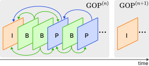
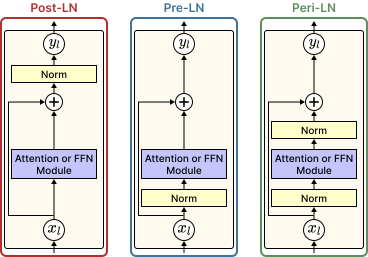

# 3. Background

## 3.1. Group of Pictures (GOP) Structure

In modern video compression standards, such as H.264 and H.265, reducing temporal redundancy between consecutive frames is a key mechanism for optimizing storage. Based on data dependencies and coding techniques, frames within a compressed video sequence are generally categorized into three primary types [$\sout{CITE}$-Compressed Video Contrastive Learning]():

1. **I-frame (Intra-coded frame):** An I-frame, also known as a keyframe, is encoded independently using intra-prediction. It does not rely on any other frames for reconstruction. As a result, an I-frame contains complete appearance information, capturing the full spatial context and original objects within a scene.
2. **P-frame (Predictive frame):** A P-frame uses uni-directional inter-prediction. To save storage space, it only records the visual differences relative to a preceding reference frame (which can be either an I-frame or a previously decoded P-frame). These differences are efficiently encoded using motion vectors and residual errors.
3. **B-frame (Bi-predictive frame):** A B-frame uses bi-directional inter-prediction. It references information from both past and future frames to find the best matching blocks, maximizing storage efficiency. Similar to P-frames, its content is represented by motion vectors and residuals.

**Group of Pictures (GOP) Structure.** The I-frames, P-frames, and B-frames are not arranged randomly; rather, they follow a periodic, repeating pattern known as the Group of Pictures (GOP) structure. As illustrated in Figure [$\sout{???}$](), each GOP strictly begins with an I-frame and includes all subsequent P-frames and B-frames until the next I-frame appears. 

<figure style="align: left; text-align:center;">
    
    <figcaption>Figure 1. The Group of Pictures (GOP) structure in compressed video. In each GOP, the first frame is always an I-frame, which is then followed by several P/B-frames until the next I-frame appears. The arrows indicate the reference dependencies for motion compensation.</figcaption>
</figure>

Typically, a GOP serves as an independently decodable unit within the video bitstream (often referred to as a closed GOP). This means that frames within one specific GOP do not reference any frames located in adjacent GOPs. Because of this structural independence, we can naturally view a compressed video as a continuous sequence of GOPs rather than a sequence of individual frames, treating each GOP as a distinct semantic "unit of information".

**Discussion.** In traditional video captioning frameworks, models often process densely sampled individual frames. However, this dense sampling strategy is highly computationally expensive and often introduces massive redundant visual information, which can easily overwhelm the video captioning network. By shifting the perspective and utilizing the GOP structure as the fundamental input unit, we can effectively eliminate temporal redundancy while preserving the most critical spatio-temporal dynamics required to generate accurate captions.

## 3.2. Transformer Building Blocks

The standard Transformer architecture was originally designed with an encoder block and a decoder block, each composed of a stack of identical layers. However, in many modern variants, this architecture can be flexibly adapted (e.g., using a decoder-only structure) to suit specific tasks. The core components within these layers are the attention mechanism and the position-wise feed-forward network (FFN), along with residual connections and layer normalization.

### 3.2.1. Attention Mechanism

**Scaled Dot-Product Attention.** At the core of the Transformer is the Scaled Dot-Product Attention mechanism, which computes attention scores by mapping a set of Query $(Q)$, Key $(K)$, and Value $(V)$ representations. The general mathematical formulation is expressed as follows:

$$
\begin{align}
\text{Attention}(Q, K, V) = \text{Softmax}\left(\frac{Q K^T}{\sqrt{d_k}}\right) V, 
\end{align}
$$

where $\sqrt{d_k}$ is a scaling factor based on the dimension of the keys. As $d_k$ increases, the variance of the dot products between $Q$ and $K$ tends to grow, resulting in extremely large values. These large values push the $\text{Softmax}$ function into saturated regions with extremely small gradients. By scaling down the raw attention scores by $\sqrt{d_k}$, we effectively normalize the inputs to a reasonable range, which prevents softmax saturation and ensures stable gradients during the training process.

**Multi-Head Attention.** Instead of performing a single attention function, Transformer models typically use Multi-Head Attention (MHA). This mechanism allows the model to jointly attend to information from different representation subspaces. The MHA is computed as follows:

$$ 
\begin{align}
\text{MultiHead}(Q, K, V) = \text{Concat}(\text{head}_1, \dots, \text{head}_h) W^O, 
\end{align}
$$

$$ 
\begin{align}
\text{where } \text{head}_i = \text{Attention}(Q W_i^Q, K W_i^K, V W_i^V),
\end{align}
$$

where $W_i^Q$, $W_i^K$, $W_i^V$ are learned projection matrices for each head $i$, $W^O$ is the learned output projection matrix to combine the gathered information, and $h$ is the number of heads. Multiple heads enable the model to capture different types of relationships in parallel.

**Self-Attention and Cross-Attention.** Based on the origin of $Q$, $K$, $V$, attention modules in the Transformer can be categorized into two primary types: self‑attention and cross‑attention.
*   **Self-Attention:** In a self‑attention mechanism, $Q$, $K$, $V$ are all derived from the same input sequence (e.g., the hidden states of previously generated tokens). Self‑attention enables the model to effectively capture internal dependencies among elements within the same sequence.
*   **Cross-Attention:** Cross‑attention occurs when $Q$, $K$, $V$ come from different sources. In this case, $Q$ is taken from one representation (e.g., the current decoder states), while $K$ and $V$ are taken from another (e.g., encoder outputs). Cross‑attention naturally acts as a routing mechanism that helps the attention module gather necessary semantic context from various information sources.

### 3.2.2. Feed-Forward Network

The second key component in each Transformer layer is the position-wise feed-forward network (FFN). This network typically consists of two linear transformations separated by a non-linear activation function. In traditional Transformer architectures, the most commonly used activation function is ReLU. However, in this study, we replace ReLU with the Gaussian Error Linear Unit (GELU) [$\sout{CITE}$-GAUSSIAN ERROR LINEAR UNITS]() activation, following the successful practices of well-known models like Google BERT [$\sout{CITE}$-BERT]() and OpenAI GPT. The computation of the FFN with a GELU activation is as follows:

$$
\begin{align}
\text{FFN}(X) = \text{GELU}(X W_1 + b_1) W_2 + b_2,
\end{align}
$$

where $W_1$, $W_2$, $b_1$, and $b_2$ are learnable parameters. GELU is defined as

$$
\begin{align}
\text{GELU}(x) = x\Phi(x),
\end{align}
$$

where $\Phi(x)$ denotes the Cumulative Distribution Function (CDF) of the standard Gaussian distribution. A commonly used practical approximation is

$$
\begin{align}
\text{GELU}(x)\approx 0.5x\big(1+\tanh[\sqrt{2/\pi}(x+0.044715x^3)]\big).
\end{align}
$$

### 3.2.3. Layer Normalization Strategies

During the training of deep Transformer models, the choice of Layer Normalization (LN) placement plays a critical role in controlling gradient stability and convergence speed. Historically, two main strategies, Post-LN and Pre-LN, have been widely adopted despite their limitations in large-scale training.

**Post-LN.** In this strategy, normalization is applied after adding the module's output to the residual stream [$\sout{CITE}$-Attention is all you need]().

$$y_l = \text{Norm} \big(x_l + \text{Module}(x_l)\big), $$

where $x_l$ and $y_l$ represent the input and output hidden states of the $l$-th sub-layer, respectively. Here, $\text{Module}$ denotes either the Attention or FFN module in the Transformer sub-layer, and $\text{Norm}$ refers to a normalization operation such as LayerNorm or RMSNorm.

Although Post-LN effectively limits the variance of the hidden states, it often weakens gradient signals as they propagate backward. This leads to the vanishing gradient problem in deep networks, resulting in slower and unstable convergence [$\sout{CITE}$-On layer normalization in the transformer architecture | Transformers get stable: An end-to-end signal propagation theory for language models]().

**Pre-LN.** To address the gradient flow issue, Pre-LN applies normalization to the hidden state before it enters the module [$\sout{CITE}$-On layer normalization in the transformer architecture](). 

$$y_l = x_l + \text{Module}\big(\text{Norm}(x_l)\big). $$

Although Pre-LN significantly improves gradient propagation during early training, it leaves the main residual path completely unnormalized. As a result, the variance of hidden states can accumulate exponentially across layers, causing "massive activations" that can severely destabilize the optimization process [$\sout{CITE}$-Massive activations in large language models]().

**Peri-LN: An Enhanced Normalization Strategy.** To overcome the main weaknesses of both Post-LN and Pre-LN, recent studies have begun to adopt a third strategy termed **Peri-LN** [$\sout{CITE}$-Peri-LN: Revisiting Normalization Layer in the Transformer Architecture](). Essentially, Peri-LN can be viewed as an improved version of Pre-LN, where an additional normalization layer (Output-LN) is placed immediately after the module's output. The mathematical formulation is defined as:

$$y_l = x_l + \text{Norm}\Big(\text{Module}\big(\text{Norm}(x_l)\big)\Big). $$

For clarity, the placements of the normalization layers in the Post-LN, Pre-LN, and Peri-LN architectures are visually compared in Figure [$\sout{???}$](). By normalizing both the inputs and the outputs of the Attention and FFN modules, Peri-LN acts as a robust self-regularizing mechanism. It regulates the variance from both ends of the module, effectively introducing a damping factor that prevents sudden spikes in gradients even when the module produces extremely large activation values. 

<figure style="align: left; text-align:center;">
    
    <figcaption>Figure 2. The placements of normalization layers in a Transformer sub-layer. From left to right: the Post-LN, Pre-LN, and Peri-LN strategies.</figcaption>
</figure>

By achieving a more balanced variance growth and a more stable gradient flow, Peri-LN continuously guarantees high convergence stability. Driven by these clear benefits, we directly apply the Peri-LN strategy across all Transformer building blocks in our proposed video captioning model. 

**Implementation Note.** Because the Peri-LN strategy and residual connections are applied consistently to every Attention and FFN module, we omit them from both the mathematical formulas and the overall architecture diagram in the subsequent methodology sections. This simplification helps avoid unnecessary repetition and keeps the model description clear and easy to follow.
